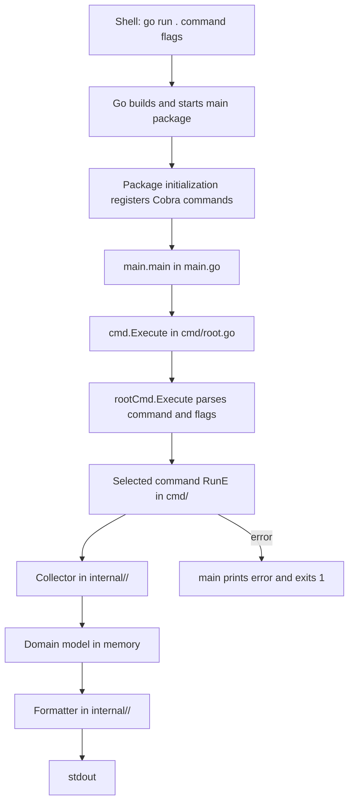

# TSYX execution flow

This document follows a command from the shell through the current TSYX code
and into its Linux data sources. The examples assume the command is run from
the repository root, for example `go run . mem --view detailed`.

## Overall call path

### Startup and command selection

1. `go run .` builds and launches the module's `main` package. The Go tool
   resolves the module dependencies listed in `go.mod` if needed.
2. `main.go` imports `cmd`. Before `main()` runs, Go initializes the imported
   package. The `init()` functions in `cmd/cpu.go`, `cmd/disk.go`, `cmd/mem.go`,
   `cmd/network.go`, and `cmd/uptime.go` attach their Cobra commands to
   `rootCmd` with `rootCmd.AddCommand(...)`.
3. `main()` calls `cmd.Execute()` in `cmd/root.go`. That function calls
   `rootCmd.Execute()`, which parses the command and its flags and invokes the
   selected command's `RunE` function.
4. On success, the selected command returns `nil`. If a command returns an
   error, `main.go` prints it to standard output and exits with status 1.

The root command is defined in `cmd/root.go`. Cobra also provides the `help`
and `completion` commands shown by `go run . --help`; they are not domain
collectors.

## Domain command flow

### `cpu`

`cmd/cpu.go` prints its initialization and OS lines, checks `runtime.GOOS`, and
rejects non-Linux systems. On Linux it calls `internal/cpu.LinuxCollect()` in
`internal/cpu/collector.go`.

The collector reads `/proc/cpuinfo`, splits it into lines, and maps recognized
fields into a `CPUInfo` value defined in `internal/cpu/models.go`. The command
passes that value to `internal/cpu.Format()` in
`internal/cpu/formatter.go`, then prints the returned string.

### `disk`

`cmd/disk.go` first checks that the OS is Linux, then calls
`internal/disk.LinuxCollect()` in `internal/disk/collector.go`. The collector
uses `golang.org/x/sys/unix.Statfs` on `/` to get filesystem block and inode
statistics, calculates total, used, and free space, and returns a `DiskInfo`
model from `internal/disk/models.go`.

After collection, the command normalizes and validates `--unit`/`-u`, calls
`internal/disk.Format()` in `internal/disk/formatter.go`, and prints the
result. The formatter converts byte counts to the requested or automatic unit
and constructs the disk summary.

### `mem`

`cmd/mem.go` checks for Linux and calls `internal/memory.LinuxCollect()` in
`internal/memory/collector.go`. The collector reads `/proc/meminfo`, parses
recognized numeric fields (reported by Linux in kB), and fills a `MemoryInfo`
model from `internal/memory/models.go`.

The command normalizes and validates `--view`/`-v` and `--unit`/`-u`, then
selects one formatter in `internal/memory/formatter.go`:

- `summary` calls `FormatSummary`.
- `detailed` calls `FormatDetailed`, which includes the summary plus additional
  memory fields.
- `kernel` calls `FormatKernel`, which includes the detailed view plus kernel
  memory and page information.

The selected formatter returns a string, and `cmd/mem.go` prints it.

### `uptime`

`cmd/uptime.go` checks for Linux and calls `internal/uptime.LinuxCollect()` in
`internal/uptime/collector.go`. The collector reads `/proc/uptime`, parses its
first field as elapsed seconds, and converts it to days, hours, minutes, and
seconds in the `DeviceUptime` model from `internal/uptime/models.go`.

`internal/uptime/formatter.go` turns the model into a readable duration string;
the command prints that string.

## Network command flow

`cmd/network.go` implements `net`. It checks for Linux, normalizes the
`--branch`/`-b` alias (`p`, `s`, or `e`), validates the selected branch and
file, and builds a key such as `proc_arp` or `etc_services`.

Before data collection, the command prints the selected branch and file and
then the key. For a key with a `switch` case, it calls a matching collector in
`internal/network/collector.go`. The collector uses `DirMap` in that file to
resolve the key to a Linux path, reads the file, parses its contents into a
network model from `internal/network/models.go`, and returns that model. The
command passes it to a formatter in `internal/network/formatter.go`.

The current command-dispatched paths are:

| CLI selection | Collector | Linux source | Formatting behavior |
| --- | --- | --- | --- |
| `net -b proc -f arp` | `LinuxCollectArp` | `/proc/net/arp` | `FormatARP` prints a table |
| `net -b proc -f dev` | `LinuxCollectDev` | `/proc/net/dev` | `FormatDev` prints interface counters |
| `net -b proc -f if_inet6` | `LinuxCollectIfInet6` | `/proc/net/if_inet6` | `FormatIfNet6` prints IPv6 addresses |
| `net -b proc -f igmp` | `LinuxCollectIGMP` | `/proc/net/igmp` | `FormatIGMP` prints multicast groups |
| `net -b proc -f igmp6` | `LinuxCollectIGMP6` | `/proc/net/igmp6` | `FormatIGMP6` prints multicast groups |
| `net -b proc -f ptype` | `LinuxCollectPtype` | `/proc/net/ptype` | `FormatPType` prints packet handlers |
| `net -b etc -f passwd` | `LinuxCollectPasswdFile` | `/etc/passwd` | Parsed result is discarded; formatter is TODO |
| `net -b etc -f shells` | `LinuxCollectShellsFile` | `/etc/shells` | Formatter result is currently discarded |
| `net -b etc -f protocols` | `LinuxCollectProtocolRegistry` | `/etc/protocols` | Formatter result is currently discarded |
| `net -b etc -f services` | `LinuxCollectServicesFile` | `/etc/services` | Formatter result is currently discarded |

The `/etc` detailed formatters return strings, but `cmd/network.go` does not
print those return values. Those selections therefore currently print the
branch and key but not their formatted records. The passwd selection also
collects its model without printing it.

The network command accepts additional `proc`, `sys`, and `etc` file names, but
acceptance is not the same as dispatch. `proc_route` has an empty switch case;
other accepted keys, including `sys_class_net`, have no command-side handler.
They return successfully after printing the branch and key, without invoking
their collector. Although `internal/network/collector.go` and
`internal/network/scanner.go` contain additional parsing and sysfs helpers,
those helpers are not automatically run just because a selector is accepted.

## Data and output boundaries

- `cmd/` owns CLI registration, flag parsing, platform checks, branch/view/unit
  validation, and the decision about which collector and formatter to call.
- `internal/<domain>/collector.go` reads operating-system data and parses it
  into domain models. Collectors return errors to the command instead of
  printing those errors themselves.
- `internal/<domain>/models.go` defines data structures passed between
  collectors and formatters.
- `internal/<domain>/formatter.go` creates presentation output. In CPU, disk,
  memory, and uptime flows the command prints the returned string. Some network
  formatters print directly, while others return strings; the network command
  must print those returned strings for them to appear.
- The active collectors depend on Linux interfaces and files such as `/proc`,
  `/sys`, and `/etc`, so these command paths are Linux-specific.